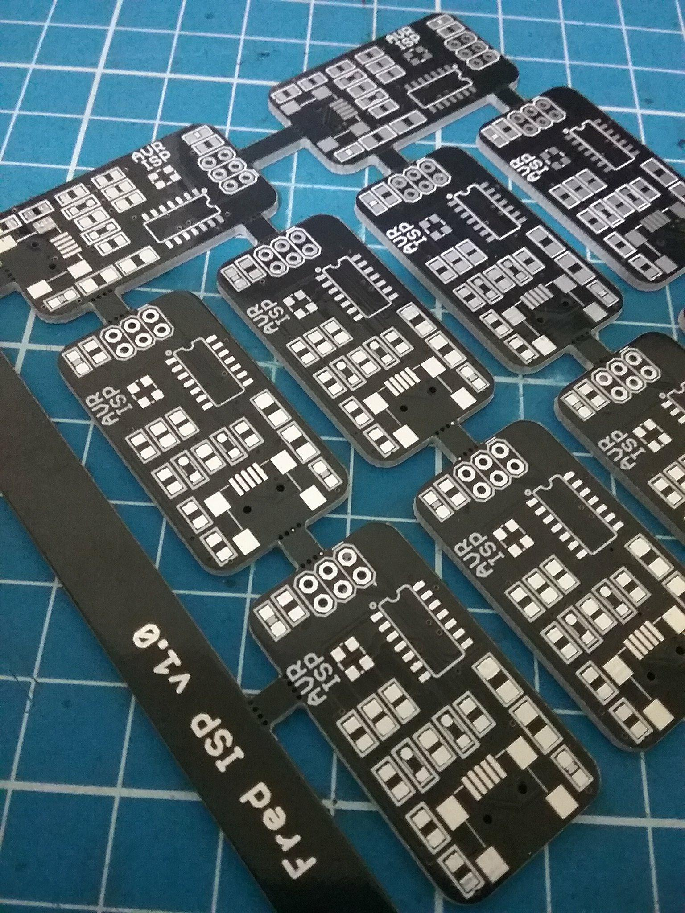

# FredISP 

### AVR USB ISP programmer based on the FabISP project.

The FredISP is a tiny, low cost and opern source usb ISP programmer for AVR microcontrollers.

This project is based on the FabISP programmer and the V-USB usign USBtiny firmware and drivers.

The programmer is compatible with Windows, MacOS and Linux.




##### Project structure:

* Firmware folder: contains the firmware for the FredISP board. It was created with APOS tool and compiled for the ATtiny4 microcontroller running at 16 Mhz.
* Hardware folder: Contains the schematic and board Eagle files for the FredISP programmer.


----

### Installation


The programmer works with the usbtiny software, so the PC will recognize it as such. Linux and MacOS do not need to install drivers, the avrdude fotware is compatible with this programmer.

In Windows it is necessary to install the USBTiny driver of Adafruit® and the avrdude program. The driver installer is in the "drivers" folder. After having installed it, it will appear as "USBtiny" in the device manager.

To use the programmer it is necessary to install the avrdude software, which is available for Linux, MacOS and Windows systems.

In Linux operating systems it can be installed with the following commands:

Debian and derivates:

```bash
    sudo apt-get install avrdude
```

Fedora and RedHat:

```bash
    sudo yum install avrdude
```

Achr Linux and Derivates:

```bash
    sudo pacman -Sy avrdude
```

On MacOS operating systems it is possible to install it using homebrew:


```bash
    brew install avrdude
```

For Windows it is necessary to download the avrdude program executables and install them, preferably in the path C: \ windows \ avrdude. You must also add the installation folder to the end of the system path variablae.

[Download avrdude for windows](http://download.savannah.gnu.org/releases/avrdude/avrdude-6.3-mingw32.zip "avrdude download for Windows")

To use the FredISP with avrdude, you only need to specify the "usbtiny" programmer in the -c command line option, eg:


 avrdude __-c usbtiny__ -p atmega328p

---
### Linux users


In Linux it is necessary to make some configurations so that the avrdude program and the programmer are used without administrator's permission.

First you have to add your user to the "dialout" group (in debian based distributions) with the command:

``` bash
sudo adduser MYUSER dialout
``` 

Then you have to create the file with the device rules for avrdude in the path /etc/udev/rules.d (the path of the udev folder may vary from one system to another). It can be created with the following command:

``` bash
sudo touch /etc/udev/rules.d/99-avr.rules
``` 

You have to add the definitions of the programmers by editing the file:

``` bash
sudo nano /etc/udev/rules.d/99-avr.rules
``` 

``` bash
# Programmers for avrdude
ATTR{idVendor}=="03eb", ATTR{idProduct}=="2104", GROUP="dialout", MODE="0660" # AVRISP mkII
ATTR{idVendor}=="03eb", ATTR{idProduct}=="2107", GROUP="dialout", MODE="0660" # AVR-Dragon
ATTR{idVendor}=="03eb", ATTR{idProduct}=="2103", GROUP="dialout", MODE="0660" # JTAG ICE mkII
ATTR{idVendor}=="03eb", ATTR{idProduct}=="2106", GROUP="dialout", MODE="0660" # STK600
ATTR{idVendor}=="16c0", ATTR{idProduct}=="05dc", GROUP="dialout", MODE="0660" # USBASP von www.fischl.de
ATTR{idVendor}=="03eb", ATTR{idProduct}=="2ffa", GROUP="dialout", MODE="0660" # AT90USB
ATTR{idVendor}=="10c4", ATTR{idProduct}=="ea60", GROUP="dialout", MODE="0660" # AVR910
ATTR{idVendor}=="03eb", ATTR{idProduct}=="2105", GROUP="dialout", MODE="0660" # AVR ONE
ATTR{idVendor}=="03eb", ATTR{idProduct}=="210d", GROUP="dialout", MODE="0660" # Atmel XPLAIN CDC Gateway
ATTR{idVendor}=="03eb", ATTR{idProduct}=="2ffb", GROUP="dialout", MODE="0660" # AT90USB AVR DFU bootloader
ATTR{idVendor}=="1781", ATTR{idProduct}=="0c9f", GROUP="dialout", MODE="0660" # usbtiny
```
The group of udev rules depend of the Linux distribution, you need to check which group have the permissions to control the hardware, for example in Manjaro and Arch linux the group is __uucp__. 

And finally reload the device rules for the changes to take effect:

```bash
sudo udevadm control --reload 
sudo udevadm trigger --action=add
```